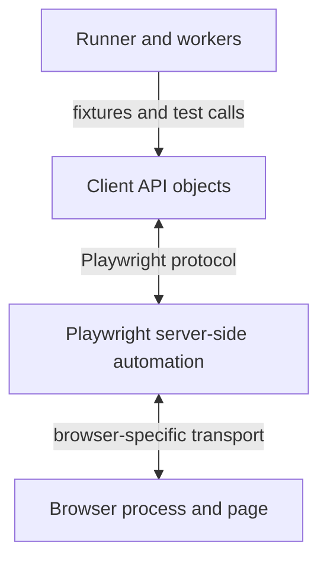
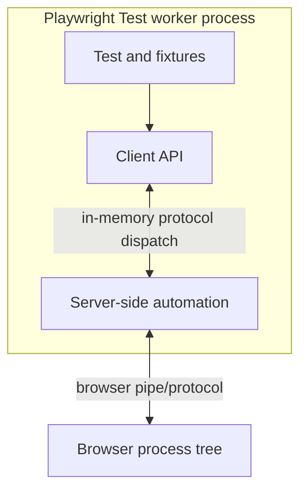
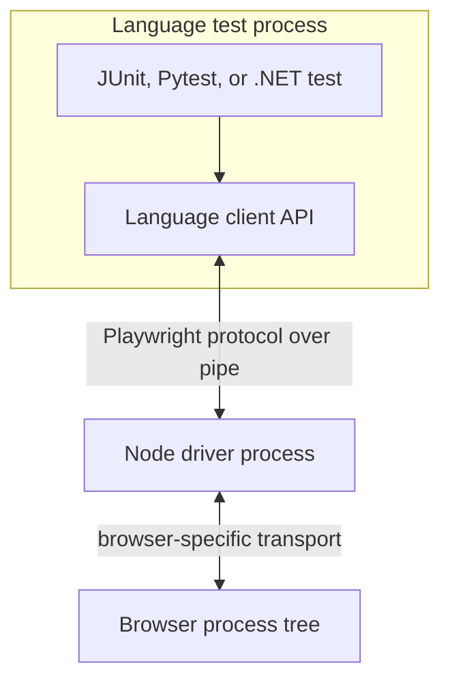
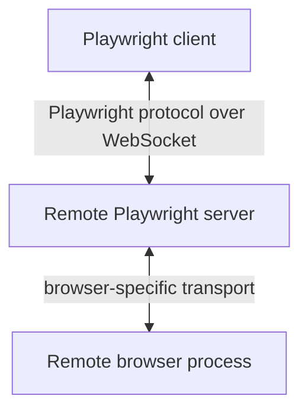
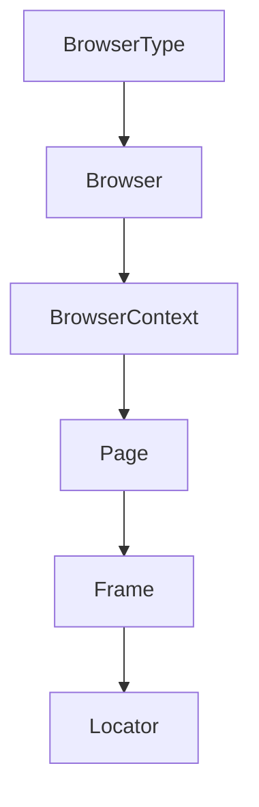

# Chapter 3 — Architecture You Can Draw and Defend

## What you will learn

By the end of this chapter, you will be able to:

- separate Playwright Test, worker processes, client API objects, the Playwright protocol, server-side automation, browser protocols, and browser processes;
- draw the local TypeScript, non-Node language-binding, and remote-connection topologies accurately;
- explain why “one WebSocket from the test to the browser” is not a universal Playwright diagram;
- follow one locator click from test code to browser input and back;
- identify where actionability, tracing, routing, contexts, and reports are owned;
- answer architecture interview questions without confusing logical layers with operating-system processes.

Read this chapter for understanding, not memorization. The implementation can evolve. The useful boundaries—runner, client API, Playwright protocol, automation server, browser transport, and browser—are the durable part.

---

## 3.1 Why architecture belongs in a testing book

Most engineers can use Playwright without knowing its internals.

They can also lose hours because they do not know which system failed.

Consider four errors:

```text
Error: worker process exited unexpectedly
Error: Failed to read message from driver, pipe closed
Error: browserType.launch: Executable doesn't exist
Error: locator.click: Timeout exceeded while waiting for element to be stable
```

Those errors belong to different boundaries:

- the test runner and its worker;
- a language client and its driver process;
- Playwright and the browser executable;
- the automation implementation and page state.

If your architecture is only “test talks to browser,” all four failures look alike.

A good architecture model lets you ask a better first question:

> Which boundary stopped doing its job?

That question improves debugging, framework design, and interview answers.

---

## 3.2 The logical model: four responsibilities

Start with responsibilities, not processes.



The four boxes answer four different questions.

### Runner and workers

The runner owns the test campaign:

- configuration loading;
- test discovery;
- project expansion;
- worker processes;
- fixture orchestration;
- retries;
- timeouts at runner/test scope;
- annotations and tags;
- result collection;
- reporters.

The runner does not decide whether a button receives pointer events. That belongs lower in the stack.

### Client API objects

These are the objects your test code touches:

- `Playwright`;
- `BrowserType`;
- `Browser`;
- `BrowserContext`;
- `Page`;
- `Frame`;
- `Locator`;
- `Request` and `Response`;
- `Download`, `Dialog`, `WebSocket`, and others.

Client objects expose the public API and send validated protocol calls. They also receive results, events, object-creation messages, and disposal messages.

### Playwright server-side automation

This side owns the implementation that turns a high-level Playwright operation into browser work. It includes server-side domain objects, dispatchers, browser-specific adapters, selectors, actionability behavior, routing, instrumentation, screenshots, video coordination, and tracing support.

“Server-side” is a code-boundary term here. It does not always mean a separate machine or even a separate process.

### Browser process and page

The browser owns:

- browser contexts and pages at the engine level;
- DOM and accessibility state;
- JavaScript execution;
- layout and paint;
- network behavior;
- input dispatch;
- frames, workers, and service workers;
- screenshots and rendering data requested through the automation channel.

The browser reports facts. Playwright interprets those facts according to the requested operation.

> **Interview signal**  
> When an interviewer asks for Playwright architecture, start with responsibilities. Then state that process and transport details differ by language and connection mode. That one qualification separates an accurate answer from a memorized diagram.

---

## 3.3 Playwright Test is not the Playwright Library

The package `@playwright/test` contains a full Node test experience. The `playwright` package exposes the browser automation library without the Playwright Test runner.

This distinction explains why two codebases can use the same `Page` API and have very different capabilities around them.

```ts
// Playwright Test
import { expect, test } from '@playwright/test';

test('checkout', async ({ page }) => {
  // runner supplies and cleans up page
});
```

```ts
// Playwright Library
import { chromium } from 'playwright';

const browser = await chromium.launch();
const page = await browser.newPage();
// your script owns lifecycle and orchestration
await browser.close();
```

With the library, you choose or build orchestration. With Playwright Test, the runner already knows about workers, projects, fixtures, retries, reports, traces, and test isolation.

### The runner’s process model

Playwright Test uses a coordinator and worker processes. The exact implementation is version-bound, but the practical model is stable:

- the coordinator builds and schedules the run;
- workers load test files and execute tests;
- a worker can execute several tests over its lifetime;
- after certain failures, the runner may discard a worker and start another;
- each test receives fresh test-scoped fixtures such as a browser context and page;
- worker-scoped fixtures live longer and therefore carry more isolation risk.

Workers are operating-system processes, not browser contexts and not shards.

```text
worker  = local process executing test code
context = isolated browser session
project = named configuration that produces test cases
shard   = partition of the overall suite, often on another CI runner
```

Chapter 22 turns those definitions into a scaling model.

---

## 3.4 Local TypeScript: client and server can be in one process

The common TypeScript diagram in the supplied draft shows a test connecting through a persistent local WebSocket to a separate Node driver.

That is not the correct universal description.

Playwright’s current Node implementation includes an in-process client/server path. Client and server-side objects still communicate through the Playwright protocol boundary, but the messages can be dispatched in memory rather than crossing a WebSocket or child-process pipe.



This is an important architectural idea:

> A protocol boundary does not require a network boundary.

The client and server code remain separated. Client code does not import server implementation directly; messages cross through connection and dispatcher abstractions. In the in-process path, the transport is effectively in-memory dispatch scheduled inside Node.

Why preserve the protocol when both sides are local?

- the same public API model can support different languages;
- remote connections can reuse the same object/message model;
- object lifecycles and events have one consistent representation;
- the client remains insulated from browser-specific implementation;
- the server implementation can validate and dispatch calls uniformly.

### There is still more than one process

“In process” describes the Playwright client/server relationship inside the worker. The browser is still a separate process tree.

A Chromium run may include a browser process, renderer processes, utility processes, GPU-related processes, and others. Firefox and WebKit organize work differently.

Do not promise one process per page or one renderer per test as a universal rule. Browser process allocation changes with engine, site isolation, origin, platform, and browser version.

The durable fact is simpler: your test worker cannot directly touch the browser’s memory. Playwright communicates through the browser’s automation transport.

---

## 3.5 Java, Python, and .NET: the driver process matters

The non-Node bindings cannot execute Playwright’s Node server implementation directly inside the Java VM, Python interpreter, or .NET runtime.

They use language-specific client objects and communicate with the Playwright driver implementation running as a Node child process.

The normal local transport is a pipe/standard-input-and-output style channel, not a required WebSocket listening on `127.0.0.1`.



The Playwright Java source constructs a Node driver process and has a `PipeTransport`. The Python async context manager likewise creates a connection over `PipeTransport`.

This explains errors such as:

```text
Failed to read message from driver, pipe closed
```

The page locator may be perfectly valid. The communication process disappeared.

Possible causes include:

- incompatible driver package contents;
- process launch restrictions;
- antivirus or endpoint controls;
- a killed child process;
- environment-variable or path problems;
- resource exhaustion;
- an unhandled driver failure.

Adding a locator wait cannot repair a closed pipe.

> **In Java**  
> Your JUnit or TestNG process owns test orchestration. The Java Playwright objects are protocol clients. A bundled or configured Node runtime launches the driver implementation. The driver launches and controls browser processes. This is why “Java binding” does not mean the Playwright implementation was rewritten independently in Java.

### Shared implementation, different ecosystems

The official language guidance states that core browser-automation features share the same underlying implementation, while test-ecosystem integration differs.

That distinction is more accurate than saying “other bindings are just wrappers” or “they always lag.”

The public surface, runner integration, release timing, and language idioms still require verification. But actionability and browser automation are not separately reinvented by every binding.

---

## 3.6 Remote Playwright connections: where WebSocket is correct

Playwright can launch a browser server and expose a WebSocket endpoint. A compatible Playwright client can connect to that endpoint with `browserType.connect()`.



This is a real and useful WebSocket architecture.

It is not the default explanation for every local TypeScript test.

### Version compatibility

The client connecting to a Playwright browser server must use a compatible Playwright version. Remote protocols are not an invitation to mix arbitrary releases.

### Network perspective changes

In a remote connection, “localhost” becomes ambiguous.

- A URL opened by the browser is resolved from the browser machine’s network.
- A file path passed to an operation may need to exist on the correct side of the connection.
- test attachments and browser artifacts require an explicit storage plan.
- latency now affects control messages and debugging.

Chapter 24 covers `exposeNetwork`, artifacts, remote execution, and cloud trade-offs.

### `connect()` is not `connectOverCDP()`

These APIs connect to different servers.

`browserType.connect()` attaches a Playwright client to a Playwright server endpoint and speaks Playwright’s protocol.

`chromium.connectOverCDP()` attaches to a Chromium-based browser exposing the Chrome DevTools Protocol.

The CDP connection is Chromium-only and has different capability and fidelity characteristics. It is useful for existing browser sessions, corporate profiles, debugging, or specialized infrastructure. It is not a drop-in synonym for a Playwright server connection.

> **Trap**  
> A URL beginning with `ws://` does not tell you which protocol is on it. A Playwright server WebSocket and a Chromium CDP WebSocket are not interchangeable.

---

## 3.7 The Playwright protocol

The client API and server-side implementation communicate with structured messages.

The current source architecture defines interfaces, commands, events, and types. Conceptually, calls look like:

```json
{
  "id": 41,
  "guid": "frame@9f2c",
  "method": "click",
  "params": {
    "selector": "internal:role=button[name=\"Pay now\"i]",
    "strict": true
  }
}
```

Do not depend on this exact payload. It is an illustrative internal message, not a public contract.

The important fields are the ideas:

- `id` correlates a response with a request;
- `guid` identifies a remote object;
- `method` names the operation;
- `params` carries validated arguments;
- responses return results or errors;
- events arrive without waiting for a client request;
- lifecycle messages create, adopt, and dispose protocol objects.

### Objects form a remote tree

A `Page` client object is associated with a server-side page object. A `BrowserContext` owns pages. A `Browser` owns contexts. Protocol identifiers connect client objects to their corresponding server-side objects.

When the browser closes a page, an event travels back and the client object’s lifecycle changes. When an object is disposed, later calls can fail because the remote target no longer exists.

This is why an error can say “Target page, context or browser has been closed.” The JavaScript variable may still exist. The remote object it represents does not.

### Two-way does not mean network

Events are a crucial part of the model:

- page created;
- request started;
- response received;
- dialog opened;
- download began;
- console message emitted;
- page closed.

The connection must support messages in both directions. That can be in-memory dispatch, a pipe, or a WebSocket depending on topology.

This is the correction to remember:

> Playwright has a bidirectional protocol model. It does not have one mandatory transport for every language and deployment mode.

---

## 3.8 From Playwright to each browser

The Playwright protocol is not the same as the browser’s own automation protocol.

Playwright’s server-side browser adapters translate its model into the engine-specific channel.

### Chromium

Chromium exposes the Chrome DevTools Protocol. Playwright’s Chromium implementation uses CDP-style transport to launch, create contexts and pages, inspect targets, evaluate JavaScript, observe network activity, and dispatch input.

Playwright 1.61 ships a Chromium/Chrome-for-Testing revision matched to the release and is also tested against documented stable Chrome and Edge channels.

### Firefox

The default Playwright Firefox path uses Playwright’s patched Firefox build and its Juggler automation protocol over a pipe. The 1.61 source still contains the `-juggler-pipe` launch path.

The current source also contains a channel-based path for Mozilla/Firefox BiDi variants. That is exactly why a printed architecture diagram should name its baseline and avoid claiming one eternal Firefox transport.

For this book’s default `firefox` project at 1.61, teach Juggler. In Appendix J, track the BiDi path and update the diagram when the supported default changes.

### WebKit

Playwright ships a WebKit build and talks through its WebKit automation/inspector-derived protocol implementation.

WebKit engine coverage is not the Safari application. Playwright controls its build of the engine with the capabilities it has integrated and tested.

### Why Playwright ships browsers

The package and browser builds form a tested compatibility set. Shipping the builds gives Playwright control over required patches, launch flags, protocol behavior, and revision compatibility.

The trade-off is equally important:

- reproducibility improves;
- arbitrary installed Firefox/WebKit attachment is not the normal supported model;
- the engine build may not equal the customer’s exact branded browser;
- browser upgrades are tied to Playwright upgrades unless you add branded-channel projects.

---

## 3.9 The object model you use

The ownership tree is more useful than a list of class names.



### `BrowserType`

Represents a browser family such as Chromium, Firefox, or WebKit. It launches or connects.

### `Browser`

Represents a browser instance/connection. It owns contexts.

### `BrowserContext`

Represents an isolated browser session. It owns pages, cookies, permissions, routes, tracing state, and related session configuration.

Contexts are cheap relative to whole browser processes. That property supports per-test isolation and multi-user tests.

### `Page`

Represents a tab or page-like target. It owns a main frame and can receive events for popups, dialogs, downloads, requests, responses, console messages, and errors.

### `Frame`

Represents one document/frame within a page. Navigation, selectors, and script evaluation ultimately operate in a frame context.

### `Locator`

Represents a query and operation plan associated with a frame. It is not a protocol-owned DOM node reference in the way an `ElementHandle` is. Its selector is resolved when an action or assertion uses it.

### Event objects

`Request`, `Response`, `Download`, `Dialog`, `ConsoleMessage`, `WebSocket`, and similar objects represent browser or automation events with their own lifecycles.

Understanding ownership prevents cleanup mistakes:

- closing a context closes its pages;
- closing a browser invalidates all child contexts and pages;
- retaining a JavaScript variable does not keep the remote target alive;
- a locator associated with a closed page cannot be resurrected by retrying.

---

## 3.10 The journey of one click

Follow this line:

```ts
await page.getByRole('button', { name: 'Pay now' }).click();
```

The exact internal call sequence is an implementation detail. The following conceptual journey is accurate enough to explain behavior and diagnose failures.

### Step 1: the test calls the client locator

`getByRole` creates a locator description associated with the page’s main frame. It does not immediately retrieve a DOM node.

### Step 2: `click()` starts an API call

The client records API metadata such as method, source location, and parameters. It validates and serializes the request through the Playwright protocol connection.

### Step 3: the protocol routes the message

The connection identifies the target frame/server object and dispatches the click command.

In local Node this can be in-memory protocol dispatch. In Java it crosses a pipe to the Node driver. In a remote Playwright connection it can cross a WebSocket.

### Step 4: server-side locator logic resolves the selector

Playwright asks the browser/page execution environment to evaluate the locator against the current document.

Strict mode requires exactly one target for the action.

### Step 5: actionability is evaluated

For a normal click, Playwright checks the current required conditions:

- one element;
- visible;
- stable;
- receives events;
- enabled.

If a condition is false, Playwright waits/retries within the action deadline and records call-log details.

### Step 6: the target may be re-resolved

If the page re-renders while Playwright is preparing the action, the locator model allows the operation to find the current matching element rather than relying on a permanently stored node from test code.

This is one of the mechanisms behind Playwright’s resistance to stale-element failures.

### Step 7: Playwright scrolls if required

The target is brought into view according to the action implementation. The test normally does not need a separate scroll command.

### Step 8: the browser reports geometry and hit target

Playwright uses browser/page information to determine the action point and whether another element would receive the event.

“Receives events” is not the same as “visible.” A transparent overlay can leave the target visible while intercepting the pointer.

### Step 9: input is dispatched

The browser-specific adapter sends the appropriate low-level input command through Chromium, Firefox, or WebKit’s automation channel.

The browser dispatches the mouse/pointer event sequence at the calculated point.

### Step 10: resulting events travel back

The click may trigger navigation, requests, console output, a dialog, a download, a popup, or page closure. Browser events propagate through the server-side implementation and Playwright protocol to client objects and listeners.

### Step 11: Playwright resolves or rejects the call

If the action completes, the server returns a result and the client promise resolves. If the timeout or target lifecycle fails, the error returns with call-log context.

### Step 12: the runner records the step result

Playwright Test associates the API call, timing, error, and attachments with the current test and reporter output. Tracing instrumentation can preserve action and page evidence.

This sequence explains why a single line can produce such a rich failure. The call crosses several ownership boundaries, and each boundary can contribute evidence.

---

## 3.11 Where the intelligence lives

The draft says “everything clever happens in the driver.” That is memorable and too coarse.

A more accurate map is:

| Responsibility | Primary owner |
| --- | --- |
| Test discovery, projects, workers, retries, reporters | Playwright Test runner |
| Public `Page`/`Locator` API and promises | Client API |
| Protocol object identity and message correlation | Client connection + server dispatchers |
| Locator/action implementation and actionability policy | Server-side Playwright implementation with page-injected/browser queries |
| DOM, accessibility state, layout, paint, hit testing facts | Browser/page engine |
| Network routing decision and fulfillment coordination | Server-side Playwright implementation plus browser network hooks |
| Browser requests, responses, cache, service workers | Browser/network stack |
| Trace/test-step correlation | Runner and Playwright instrumentation |
| DOM snapshots and browser evidence for trace | Instrumentation working with page/browser state |
| HTML/JUnit/blob report generation | Reporters in the runner process |

The browser is not “stupid.” It performs extremely complex layout, JavaScript, network, rendering, and event behavior.

The useful distinction is judgment:

- the browser knows the current facts;
- Playwright decides whether those facts satisfy the requested automation contract;
- the test decides whether the resulting business behavior is correct.

Three kinds of judgment. Three different failure classes.

---

## 3.12 Architecture explains familiar behavior

### Why locators survive re-rendering

The client retains a locator description. The action resolves it against current page state through the server/browser path. The test does not need to hold a DOM node reference across renders.

### Why context isolation is cheap

Contexts are browser-level isolated sessions inside a browser instance, so Playwright Test can create a fresh one per test without launching a full browser process for each test.

### Why Java gets the same actionability behavior

Java client calls cross the Playwright protocol to the Node driver implementation. The actionability policy is not independently rebuilt in every Java test framework.

### Why remote latency matters

A remote Playwright WebSocket inserts network distance into the control path. Browser work may still be fast, but many interactive calls and artifact transfers now cross a network boundary.

### Why `connectOverCDP` can differ

It attaches below Playwright’s full server endpoint model to a Chromium CDP endpoint. The available control and default-context behavior differ from a native Playwright `connect()` session.

### Why a closed pipe is not a locator timeout

The language client lost its driver transport. The page may have been fine. Diagnose process and environment evidence.

### Why a context close invalidates pages

The remote object tree is owned. Closing the parent disposes descendants, and client variables cannot keep them alive.

---

## 3.13 Failure lab — inspect the boundaries

### Lab 1: list the processes

Run one headed test and inspect the process tree with your operating system’s process viewer.

Identify:

- the Playwright CLI/coordinator;
- one or more worker Node processes;
- the browser process;
- browser child processes.

Do not assume every child process maps one-to-one to a test. Record what you observe on your platform and browser.

### Lab 2: watch API logs

Run a focused test with:

```bash
DEBUG=pw:api npx playwright test tests/ch03 --project=chromium --workers=1
```

Observe the action calls and waiting information. Connect log lines to the journey in Section 3.10.

### Lab 3: inspect protocol logging carefully

For a short local experiment:

```bash
DEBUG=pw:protocol npx playwright test tests/ch03 --project=chromium --workers=1
```

Protocol output is verbose and version-bound. Never build test assertions against it. Use it to confirm that high-level operations become structured messages and browser-specific commands.

Protocol logs can contain URLs, headers, or application data. Treat them as sensitive artifacts.

### Lab 4: close the parent

Create a context and page, close the context, then attempt a page operation.

```ts
const context = await browser.newContext();
const page = await context.newPage();

await context.close();
await page.goto('https://example.com');
```

Read the lifecycle error. Explain it using the ownership tree rather than saying “Playwright lost the page.”

---

## 3.14 Common architecture mistakes

### Mistake 1: drawing one arrow from test to browser

**Why it fails:** It cannot explain runner ownership, protocol objects, actionability, language bindings, or remote connections.

**Repair:** Draw logical responsibilities first, then the specific process topology.

### Mistake 2: claiming every local call uses WebSocket

**Why it fails:** Current Node uses an in-process protocol path; other language bindings commonly use pipes; WebSocket applies to remote Playwright server connections.

**Repair:** Say “bidirectional Playwright protocol over a topology-specific transport.”

### Mistake 3: calling the Playwright protocol CDP

**Why it fails:** Playwright’s client/server protocol is its own object model. CDP is one browser-side protocol used for Chromium paths.

**Repair:** Name both boundaries: client ↔ Playwright server, then Playwright server ↔ browser.

### Mistake 4: saying all browsers use CDP

**Why it fails:** Default Chromium uses CDP; default Firefox uses the Juggler path at this baseline; WebKit uses its own automation/inspector-derived path. BiDi adds further nuance.

**Repair:** Pin the explanation to the book version and distinguish default projects from experimental/channel-specific paths.

### Mistake 5: putting retries inside the driver

**Why it fails:** Whole-test retries are runner behavior. Assertion retry and actionability waiting are different mechanisms at other layers.

**Repair:** Name the owner and reset boundary of each retry.

### Mistake 6: calling the browser unintelligent

**Why it fails:** The browser owns DOM, JavaScript, layout, network, and rendering. The phrase hides where facts come from.

**Repair:** Say the browser reports facts, Playwright applies automation policy, and the test applies business expectations.

### Mistake 7: treating implementation details as API guarantees

**Why it fails:** Processes, internal protocols, and transport choices evolve.

**Repair:** Source and version implementation details. Build framework code only on public APIs.

---

## 3.15 Interview corner

### Q1. Explain Playwright architecture.

**30-second answer**

> I separate four responsibilities: Playwright Test coordinates projects, workers, fixtures, retries, and reports; client objects such as Page and Locator expose the API; Playwright’s server-side automation receives protocol calls and implements browser control; then browser-specific adapters talk to the browser process. The client/server protocol is bidirectional, but the transport depends on topology: in-memory in the current local Node path, pipes for normal Java/Python/.NET driver communication, and WebSocket for remote Playwright server connections.

**2-minute answer**

Add the two protocol boundaries and one ownership example:

> The Playwright protocol is not CDP. It maps client objects to server objects using messages and IDs. The server side then uses the engine-specific path—CDP for Chromium, Juggler for the default Firefox build at this baseline, and WebKit’s own automation protocol. A Browser owns contexts, contexts own pages, and pages own frames. Closing a context therefore invalidates its pages. Actionability is Playwright server-side policy based on browser/page facts; whole-test retries remain runner behavior.

**Likely follow-up:** Draw local TypeScript and Java separately.

### Q2. Where does auto-waiting happen?

**30-second answer**

> The actionability policy is implemented on Playwright’s server side, with evaluation and browser/page queries used to inspect the live element. The browser supplies DOM, layout, and hit-test facts; Playwright decides whether the action’s contract is satisfied. It is not a sleep in the test and not a generic browser feature.

### Q3. Does Playwright use WebSocket?

**30-second answer**

> It can. A remote Playwright server connection uses a WebSocket endpoint. But that is not the universal local architecture. Current local Node can dispatch the Playwright protocol in process, and language bindings commonly use a pipe to the Node driver. I name the topology before naming the transport.

### Q4. How does Playwright for Java work?

**30-second answer**

> The Java API is the client side. It launches the Playwright Node driver as a child process and communicates over a pipe using Playwright’s protocol. The driver runs the shared server-side automation and talks to the browser. JUnit or TestNG still owns test orchestration.

### Q5. Is the Playwright protocol CDP?

**30-second answer**

> No. Playwright has its own client/server protocol for objects, commands, events, and lifecycle. Its server-side Chromium adapter then speaks CDP to Chromium. Firefox and WebKit use different browser-side paths.

### Q6. Why does Playwright ship browser builds?

**30-second answer**

> It tests a specific browser revision with each Playwright release and needs integrated automation support for its Firefox and WebKit paths. Shipping the builds improves reproducibility and capability consistency. The cost is that bundled engine coverage is not always the customer’s exact branded browser, so I add Chrome/Edge channels or real-device coverage when required.

### Q7. What is the difference between a worker and a browser context?

**30-second answer**

> A worker is an operating-system process used by the test runner to execute test code. A browser context is an isolated browser session with its own cookies and storage. A worker can create many contexts over its lifetime, normally one fresh test context at a time through fixtures.

### Q8. Why can Playwright be faster than a Selenium framework?

**30-second answer**

> I do not promise it from protocol names alone. The practical speed often comes from cheap contexts, integrated parallel workers, fewer conservative hand-written waits, API-based setup, and less framework overhead. I measure the actual suite because browser work, backend capacity, data design, and CI resources can dominate either tool.

---

## 3.16 Review checklist

- [ ] The diagram separates runner, client, server-side automation, and browser.
- [ ] Logical layers are not presented as mandatory operating-system processes.
- [ ] Local TypeScript, language bindings, and remote connections have separate topology diagrams.
- [ ] WebSocket is mentioned only for the correct connection mode.
- [ ] The Playwright protocol is not mislabeled as CDP.
- [ ] Browser protocol claims are pinned to Playwright 1.61.
- [ ] Whole-test retries are assigned to the runner.
- [ ] Actionability is distinguished from assertion retry.
- [ ] Object ownership explains cleanup and target-closed failures.
- [ ] Implementation details are not used as framework contracts.

---

## 3.17 Exercises

### Exercise 1 — Draw three topologies

Without looking back, draw:

1. local TypeScript with in-process client/server dispatch;
2. Java with a Node driver child process and pipe;
3. a remote Playwright server connection over WebSocket.

Add the browser process to each. If all three diagrams are identical, study Sections 3.4–3.6 again.

### Exercise 2 — Classify ten responsibilities

Assign each item to runner, client API, server-side automation, browser, or more than one:

- project expansion;
- strict locator resolution;
- DOM layout;
- whole-test retry;
- request routing;
- HTML report;
- accessible-name computation;
- page-close event;
- browser context cookies;
- `Page` promise resolution.

Explain every “more than one” answer as a collaboration, not a vague compromise.

### Exercise 3 — Follow a click from logs

Run one click with `DEBUG=pw:api`, then with `DEBUG=pw:protocol` in a safe test environment. Mark which log lines correspond to the conceptual click journey.

Do not commit the protocol log. Inspect it for sensitive data and delete it after the exercise.

### Exercise 4 — Diagnose the boundary

For each error, identify the first boundary to investigate:

```text
worker process exited unexpectedly
pipe closed
executable doesn't exist
target page has been closed
strict mode violation
element does not receive pointer events
```

Name one piece of evidence you would collect before changing code.

---

## 3.18 Summary

1. Playwright architecture has several responsibilities: the runner coordinates tests; client objects expose the API; server-side automation implements browser control; the browser owns page execution and rendering facts.
2. The Playwright protocol is a bidirectional object/message model. Bidirectional does not mean WebSocket in every topology.
3. Current local Node can dispatch the client/server protocol in process. Java, Python, and .NET commonly communicate with a Node driver over pipes. Remote Playwright server connections use WebSocket.
4. `connect()` speaks the Playwright protocol to a Playwright server. `connectOverCDP()` attaches to Chromium through CDP. They are not interchangeable.
5. The Playwright protocol is not the browser protocol. Chromium, Firefox, and WebKit have different server-to-browser paths, and those details are version-bound.
6. A Browser owns contexts; contexts own pages; pages own frames. Closing a parent invalidates descendants even if client variables remain.
7. Actionability is Playwright policy based on live browser/page facts. Whole-test retries belong to the runner. Business correctness belongs to the test’s assertions.
8. Architecture is useful when it lets you classify a failure before you attempt a fix.

---

## Sources and version notes

This chapter targets Playwright 1.61.1. Internal architecture is not a public compatibility guarantee and must be rechecked before publication.

- [Playwright Library architecture: client, server, dispatchers, and wire format](https://github.com/microsoft/playwright/blob/main/.claude/skills/playwright-dev/library.md)
- [Playwright in-process implementation](https://github.com/microsoft/playwright/blob/main/packages/playwright-core/src/inprocess.ts)
- [Playwright out-of-process implementation](https://github.com/microsoft/playwright/blob/main/packages/playwright-core/src/outofprocess.ts)
- [Playwright driver entry point and pipe transport](https://github.com/microsoft/playwright/blob/main/packages/playwright-core/src/cli/driver.ts)
- [Playwright remote server implementation](https://github.com/microsoft/playwright/blob/main/packages/playwright-core/src/remote/playwrightServer.ts)
- [Playwright Java driver process](https://github.com/microsoft/playwright-java/blob/main/driver/src/main/java/com/microsoft/playwright/impl/driver/Driver.java)
- [Playwright Python pipe transport](https://github.com/microsoft/playwright-python/blob/main/playwright/_impl/_transport.py)
- [Playwright Firefox/Juggler launch path](https://github.com/microsoft/playwright/blob/main/packages/playwright-core/src/server/firefox/firefox.ts)
- [Firefox Juggler browser patches](https://github.com/microsoft/playwright/tree/main/browser_patches/firefox/juggler)
- [BrowserType connect APIs](https://playwright.dev/docs/api/class-browsertype)
- [Playwright supported languages](https://playwright.dev/docs/languages)
- [Playwright auto-waiting](https://playwright.dev/docs/actionability)
- [Playwright Library versus Playwright Test](https://playwright.dev/docs/library)

---

## What comes next

You now know which layers exist and who owns what.

Chapter 4 returns to the code you write. It explains test declarations, groups, steps, hooks, annotations, tags, projects, workers, and the exact isolation boundary around a test.

The architecture will keep paying rent: every runner feature can now be placed above the protocol, every locator action can be placed through it, and every browser fact can be placed below it.

