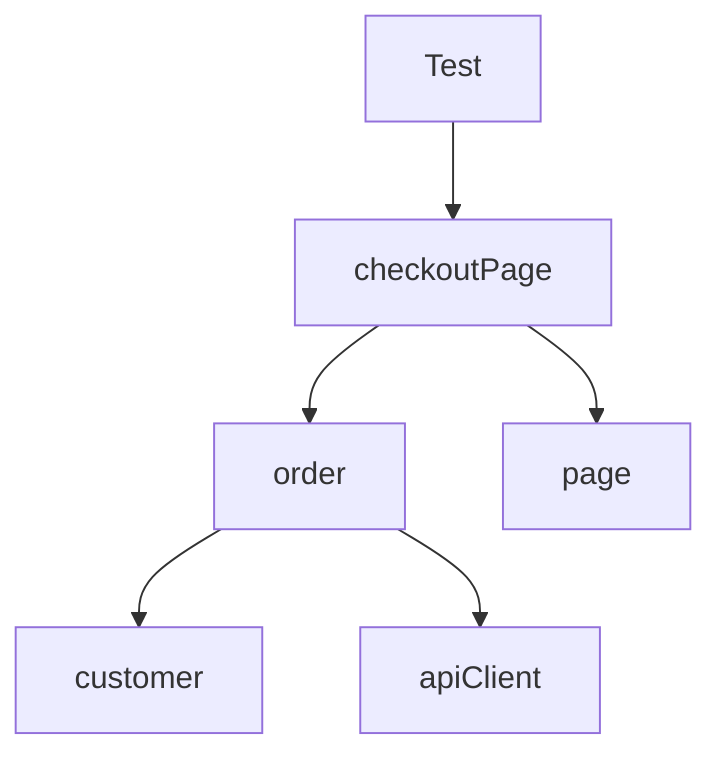

# Chapter 10 — Fixtures as Dependency Injection

A fixture is not a clever replacement for `beforeEach`.

It is a declaration of dependency, ownership, lifetime, and cleanup.

When a test asks for `{ order }`, the runner can create the account that owns it, create the API client that seeds it, provide the order to the test, and clean it up afterward. A test that asks only for `{ page }` pays for none of that work.

That is dependency injection with lifecycle management.

The difference matters at scale. Hook-heavy suites hide prerequisites in distant files, initialize resources that tests do not need, and separate cleanup from setup. Fixture-based suites can make every dependency explicit, typed, composable, and scoped.

Fixtures can also create serious problems. A worker-scoped mutable customer can leak state across tests. An automatic fixture can add invisible cost everywhere. A page override can hide navigation and authentication so completely that test intent becomes difficult to read.

The goal is not maximum fixture usage. It is honest ownership.

## What you will learn

By the end of this chapter, you will be able to:

- explain fixtures as an on-demand dependency graph;
- use `setup → use → teardown` correctly, including failure paths;
- distinguish built-in, custom, automatic, option, test-scoped, and worker-scoped fixtures;
- predict fixture setup and teardown order;
- choose fixtures versus hooks based on ownership and visibility;
- create typed domain-specific `test` exports;
- attach diagnostics and enforce console policies automatically;
- assign fixture-specific timeouts without inflating every test;
- share expensive immutable resources without leaking mutable state; and
- answer fixture interview questions at framework-design depth.

---

## 10.1 A fixture is a dependency contract

You have used fixtures since your first Playwright test:

```ts
import { expect, test } from '@playwright/test';

test('catalog opens', async ({ page }) => {
  await page.goto('/');
  await expect(page).toHaveTitle(/QualityMart/);
});
```

The `{ page }` parameter declares that the test needs the built-in page fixture. Playwright prepares its dependencies, supplies an isolated `Page`, runs the test, and closes the owned browser context afterward.

Common built-in fixtures include:

| Fixture | Scope and purpose |
|---|---|
| `page` | Isolated page for the test |
| `context` | Isolated browser context that owns the default page |
| `browser` | Browser shared for efficiency |
| `browserName` | Current engine: Chromium, Firefox, or WebKit |
| `request` | Isolated `APIRequestContext` for the test |

The test receives what it names. This is more than parameter convenience:

- dependency is visible in the signature;
- setup is on demand;
- TypeScript checks the contract;
- dependencies can compose; and

- the runner controls lifetime and teardown.

### Fixtures form a graph

Suppose `checkoutPage` depends on `order`, which depends on `customer` and `apiClient`:



Playwright resolves only the portion requested by the test. A catalog test that needs only `page` does not create a customer or order.

> **Interview answer: What is a Playwright fixture?**
>
> “A fixture is a typed, runner-managed dependency with setup, a value supplied through `use`, and optional teardown. Fixtures form an on-demand dependency graph. Their scope defines lifetime, and the runner orders setup and teardown from the graph.”

---

## 10.2 The core lifecycle is `setup → use → teardown`

Create fixtures by extending Playwright's base `test`:

```ts
import { test as base } from '@playwright/test';

type Order = {
  id: string;
  status: 'draft';
};

type Fixtures = {
  order: Order;
};

export const test = base.extend<Fixtures>({
  order: async ({ request }, use) => {
    // Setup
    const response = await request.post('/api/orders', {
      data: { status: 'draft' }
    });
    const order = await response.json() as Order;

    // Supply the fixture and pause until the test/dependants finish.
    await use(order);

    // Teardown
    await request.delete(`/api/orders/${order.id}`);
  }
});

export { expect } from '@playwright/test';
```

The `use()` call is the lifetime boundary. Code before it prepares the value. Code after it tears down owned resources.

### Teardown belongs beside setup

This locality answers important questions during review:

- Who created the resource?
- Who removes it?
- What identifier is used?
- What happens if the test fails?
- Can cleanup run after partial setup?

Playwright runs fixture teardown after the dependent test completes, including when the test fails. Cleanup should still be defensive because setup itself may fail before reaching `use()`.

```ts
order: async ({ request }, use) => {
  let orderId: string | undefined;

  try {
    const response = await request.post('/api/orders', { data: draft });
    orderId = (await response.json()).id;
    await use({ id: orderId, status: 'draft' });
  } finally {
    if (orderId) {
      await request.delete(`/api/orders/${orderId}`);
    }
  }
}
```

`try/finally` is useful when preparation has several failure points or cleanup must run even if code after `use()` throws.

### Do not assert the scenario in setup

A fixture may validate that setup succeeded. It should not hide the behavior the test claims to exercise.

Good setup validation:

```ts
if (!response.ok()) {
  throw new Error(`Could not create order: HTTP ${response.status()}`);
}
```

Hidden scenario:

```ts
checkoutPage: async ({ page }, use) => {
  await page.getByRole('button', { name: 'Place order' }).click();
  await expect(page.getByText('Order confirmed')).toBeVisible();
  await use(page);
}
```

The test would receive an already-completed journey. Put the action and business oracle in the test or a clearly named task method.

---

## 10.3 Test scope is the safe default

Custom fixtures are test-scoped by default. Playwright creates them for one test invocation and tears them down afterward.

Use test scope for mutable resources:

- browser contexts and pages;
- orders, carts, drafts, and uploaded files;
- role-specific sessions;
- per-test API clients with mutable headers;
- log buffers; and

- mocks whose behavior differs by scenario.

### Isolation includes retries

A retried test is another test invocation. A test-scoped fixture runs setup and teardown again. Data creation therefore needs unique identity or idempotency.

```ts
const id = `order-${testInfo.project.name}-${testInfo.retry}-${crypto.randomUUID()}`;
```

Do not depend only on `retry` or worker index for uniqueness across machines. Use a run namespace plus a random or centrally allocated identifier.

### Test scope costs can be worthwhile

Creating an order through an API for every test may cost 100 ms. Sharing one mutable order may save seconds while creating hours of investigation after parallel corruption.

Optimize measured bottlenecks. Isolation is often the cheaper design.

---

## 10.4 Worker scope shares cost—and risk

Worker-scoped fixtures are created once per worker process and reused by tests whose worker fixture environments match.

Declare worker types in the second generic parameter:

```ts
type WorkerFixtures = {
  workerAccount: {
    username: string;
    tenantId: string;
  };
};

export const test = base.extend<{}, WorkerFixtures>({
  workerAccount: [async ({ browser }, use, workerInfo) => {
    const username = `qa-${workerInfo.parallelIndex}`;
    const account = await createAccount(username);

    await use(account);

    await deleteAccount(account.tenantId);
  }, { scope: 'worker' }]
});
```

### `workerIndex` versus `parallelIndex`

`workerIndex` identifies the worker process and changes when a failed worker is replaced. `parallelIndex` identifies the parallel slot and remains in the range `0..workers-1` when a replacement starts.

Use a durable run namespace and understand retry behavior before using either value for backend identity.

### Good worker-scoped candidates

- an immutable reference-data snapshot;
- one server process bound to a worker-unique port;
- a read-only service client;
- an expensive account whose individual tests create isolated child data; or

- a compiled artifact.

### Dangerous worker-scoped candidates

- one shopping cart modified by many tests;
- one page or browser context;
- mutable feature flags;
- an account with a shared inbox or balance; and

- a database transaction that assumes all tests run serially.

The correct question is not, “Is setup expensive?” It is:

> Can every test use this resource independently, in any order, in parallel where configured, after another test fails, and during retry?

If not, keep mutable state test-scoped or namespace it beneath the worker resource.

> **Interview answer: Test-scoped versus worker-scoped fixtures?**
>
> “Test scope creates and tears down the dependency for each test, so it is the default for mutable state. Worker scope amortizes expensive setup across a worker, but tests must not leak mutations through it. I use worker scope for immutable or safely partitioned resources and test scope for pages, contexts, sessions, and business data.”

---

## 10.5 Dependency order follows the graph

Consider three fixtures:

```ts
const test = base.extend<{
  customer: Customer;
  order: Order;
  checkoutPage: CheckoutPage;
}>({
  customer: async ({ request }, use) => {
    const customer = await createCustomer(request);
    await use(customer);
    await deleteCustomer(request, customer.id);
  },

  order: async ({ request, customer }, use) => {
    const order = await createOrder(request, customer.id);
    await use(order);
    await deleteOrder(request, order.id);
  },

  checkoutPage: async ({ page, order }, use) => {
    await page.goto(`/checkout/${order.id}`);
    await use(new CheckoutPage(page));
  }
});
```

For a test requesting `checkoutPage`, setup proceeds from dependencies toward the test:

1. built-in dependencies such as `request` and `page`;
2. `customer`;
3. `order`;
4. `checkoutPage`;
5. test body.

Teardown reverses the dependency chain:

1. `checkoutPage` teardown;
2. `order` deletion;
3. `customer` deletion; and
4. built-in teardown.

Independent fixtures may be ordered according to what the runner needs rather than source declaration order. Never create a hidden ordering dependency between fixtures that do not declare each other.

### On-demand setup changes the cost model

```ts
test('catalog loads', async ({ page }) => {
  // customer, order, and checkoutPage are not set up.
});
```

This is one of the strongest differences from suite-wide hooks. Define many capabilities, pay only for requested branches of the graph.

---

## 10.6 Option fixtures are typed configuration

Option fixtures let projects, config, `test.use()`, or a describe block provide declarative values.

```ts
type Options = {
  market: 'US' | 'IN' | 'GB';
};

type Fixtures = {
  currency: string;
};

export const test = base.extend<Options & Fixtures>({
  market: ['US', { option: true }],

  currency: async ({ market }, use) => {
    const currencies = { US: 'USD', IN: 'INR', GB: 'GBP' } as const;
    await use(currencies[market]);
  }
});
```

Override at suite scope:

```ts
test.use({ market: 'IN' });

test('shows INR prices', async ({ currency }) => {
  expect(currency).toBe('INR');
});
```

Or configure projects:

```ts
export default defineConfig<Options>({
  projects: [
    { name: 'us', use: { market: 'US' } },
    { name: 'india', use: { market: 'IN' } }
  ]
});
```

### Options should describe environment, not hide scenarios

Good options:

- market, locale, tenant, feature profile, API mode;
- user role when projects represent role matrices; and

- controlled provider behavior.

Questionable options:

- `shouldPlaceOrder`;
- `expectedErrorText`;
- `skipAssertions`; or

- a large untyped bag that turns tests into a keyword engine.

Scenario input belongs visibly in the test or a data table. Options configure dependencies.

### Arrays require tuple care

Fixture declarations use arrays for value-plus-options tuple syntax. When the option value itself is an array, wrap the value in an extra array as documented so the runner does not interpret it as the fixture tuple.

---

## 10.7 Automatic fixtures provide policy

An automatic fixture runs even when the test does not mention it:

```ts
type AutomaticFixtures = {
  consoleGuard: void;
};

export const test = base.extend<AutomaticFixtures>({
  consoleGuard: [async ({ page }, use) => {
    const errors: string[] = [];

    page.on('console', message => {
      if (message.type() === 'error') errors.push(message.text());
    });

    await use();

    expect(errors, 'unexpected browser console errors').toEqual([]);
  }, { auto: true }]
});
```

Automatic fixtures are appropriate for universal policy:

- capture logs and attach them on failure;
- reject unexpected console or page errors;
- add correlation metadata;
- start per-test tracing beyond standard configuration; or

- enforce cleanup invariants.

### Invisible policy needs strong documentation

An auto fixture can fail a test that never mentions it. That is intentional, but failure messages must explain the policy and allow reviewed exceptions.

```ts
const allowed = [
  /ResizeObserver loop limit exceeded/
];
```

Do not grow an allowlist without ownership and expiry. A universal console guard that ignores fifty known errors provides ceremony, not confidence.

### Attach diagnostics after failure

`testInfo.status` and `testInfo.expectedStatus` are available after `use()`:

```ts
saveLogs: [async ({}, use, testInfo) => {
  const logs: string[] = [];
  await use();

  if (testInfo.status !== testInfo.expectedStatus) {
    await testInfo.attach('domain-logs', {
      body: Buffer.from(logs.join('\n')),
      contentType: 'text/plain'
    });
  }
}, { auto: true }]
```

Prefer `testInfo.attach()` to mutating attachment arrays directly. The attachment becomes part of runner reporting.

---

## 10.8 Fixtures versus hooks

Fixtures and hooks solve overlapping but different problems.

| Need | Fixture | Hook |
|---|:---:|:---:|
| Produce a typed value for selected tests | Best | Weak |
| Pair setup and teardown ownership | Best | Split across hooks |
| Compose dependencies | Best | Manual |
| Run only when requested | Best | No |
| Apply simple suite-wide preparation | Possible | Good |
| Group tests around shared narrative | Neutral | Good |
| One-time assertion about an external suite prerequisite | Possible | Sometimes good |

### Use a fixture when it owns a resource

If setup creates an account and teardown deletes it, one fixture should own both.

### Use a hook for simple visible suite behavior

```ts
test.describe('catalog search', () => {
  test.beforeEach(async ({ page }) => {
    await page.goto('/catalog');
  });

  // related catalog scenarios
});
```

This can be perfectly readable. Do not turn every navigation into a custom page override merely to claim fixture purity.

### Avoid global mutable variables from hooks

```ts
let orderId: string;

test.beforeEach(async () => {
  orderId = await createOrder();
});
```

This hides the dependency and becomes unsafe under parallel execution or refactoring. A typed `order` fixture expresses ownership.

### `beforeAll` is not a worker fixture

`beforeAll` belongs to a suite and runs once per worker that executes that suite. A worker fixture belongs to the worker dependency environment and can be reused across files whose worker fixtures match. Choose based on ownership, not the phrase “run once.”

> **Interview answer: Fixtures versus hooks?**
>
> “I use a fixture when setup produces a dependency or owns cleanup, because it is typed, on-demand, reusable, and composable. I use hooks for simple, visible behavior shared by a suite. I avoid hook-created mutable globals and do not treat `beforeAll` as equivalent to worker scope.”

---

## 10.9 Domain-specific test exports create an honest vocabulary

Centralize a coherent fixture contract:

```ts
// test/commerce-test.ts
import { test as base, expect } from '@playwright/test';

type CommerceFixtures = {
  customer: Customer;
  order: Order;
  checkout: CheckoutPage;
};

export const test = base.extend<CommerceFixtures>({
  customer: customerFixture,
  order: orderFixture,
  checkout: checkoutFixture
});

export { expect };
```

Tests import the domain contract:

```ts
import { expect, test } from '../test/commerce-test';

test('customer confirms the reviewed order', async ({ checkout, order }) => {
  await checkout.placeOrder();
  await expect(checkout.confirmation).toContainText(order.id);
});
```

### Avoid one universal test object

A single export with 70 fixtures creates autocomplete noise, ownership conflicts, slow automatic policy, and accidental coupling between domains.

Prefer cohesive exports such as:

- `commerce-test`;
- `admin-test`;
- `identity-test`; and

- a thin shared base for universal policy.

Playwright can merge test and expect extensions when independently developed fixture modules must combine. Use composition deliberately; do not recreate inheritance trees through fixture exports.

---

## 10.10 Overriding built-in fixtures changes global semantics

Playwright allows overriding `page`, `storageState`, and other fixtures:

```ts
export const test = base.extend({
  page: async ({ page, baseURL }, use) => {
    await page.goto(baseURL!);
    await use(page);
  }
});
```

Every test importing this `test` now receives an already-navigated page.

This may be a useful domain contract. It may also hide a significant precondition.

Review an override with these questions:

1. Does the new behavior match the intuitive meaning of the fixture name?
2. Does every consumer need it?
3. Can a test opt out clearly?
4. Does the override preserve isolation and cleanup?
5. Will failure point to the hidden preparation?

Often a named fixture is clearer:

```ts
catalogPage: async ({ page }, use) => {
  await page.goto('/catalog');
  await use(new CatalogPage(page));
}
```

Do not override `browser` or `context` to implement a singleton session. That removes the isolation model the runner is designed to provide.

---

## 10.11 Fixture timeouts are separate design decisions

Test-scoped fixture setup and teardown normally consume the test timeout. A slow fixture can therefore exhaust the budget before the test body meaningfully begins.

Assign a separate fixture timeout when setup has a legitimate, distinct service expectation:

```ts
reportingDataset: [async ({}, use) => {
  const dataset = await provisionReportingDataset();
  await use(dataset);
  await deleteReportingDataset(dataset.id);
}, { timeout: 60_000 }]
```

Worker-scoped fixtures receive their own timeout equal to the test timeout by default and can also override it.

Do not add 60 seconds to every fixture because CI is unreliable. Measure setup, identify the slow boundary, and fail with a useful message.

### Cleanup needs a budget too

Fixture teardown runs under runner timeout rules. Cleanup should be bounded and idempotent. A hanging delete can obscure the original failure.

For high-value evidence, attach the resource identifier before cleanup so engineers can inspect retained state when deletion fails.

---

## 10.12 Common fixture anti-patterns

### The fixture landfill

One file contains accounts, pages, APIs, database connections, email, flags, loggers, random data, and every business object. Split by domain and ownership.

### Hidden journeys

The fixture logs in, creates a product, searches, adds it to cart, and opens payment. A test called “declined card shows an error” begins after five invisible business steps. Use API setup for prerequisites and keep the protected journey visible.

### Shared mutable worker state

Tests depend on cart contents left by earlier tests. Passes locally, fails with parallel workers. Partition or return to test scope.

### Automatic everything

Every test pays for logs, database snapshots, account creation, feature flags, and three API clients. Automatic fixtures are for universal policy, not convenience.

### Assertions only in fixtures

Setup proves that preparation worked, but the test contains no decisive business oracle. Keep scenario assertions in the scenario.

### Cleanup that assumes success

Teardown dereferences an ID that setup never produced or fails if the test already deleted the resource. Make cleanup defensive and idempotent.

### Fixture dependency cycles

`order` depends on `checkoutPage`, which depends on `order`. This is a design cycle, not a runner problem. Separate data creation from UI representation.

### Passing giant bags

```ts
app: { page, api, admin, customer, order, logger, db, flags }
```

This hides actual dependencies and weakens types. Ask for named capabilities.

---

## 10.13 Selenium-to-Playwright fixture traps

### Trap 1: Recreating a base-test inheritance tree

Selenium frameworks often inherit driver setup, waits, logging, and page objects from base classes. Playwright fixtures compose capabilities without inheritance. Prefer domain exports and explicit dependencies.

### Trap 2: A singleton browser or driver fixture

The built-in `browser` is already efficiently shared while each test receives an isolated context and page. Sharing one context/page reintroduces cookie, storage, navigation, and failure leakage.

### Trap 3: Translating `@BeforeMethod` and `@AfterMethod` literally

When setup produces a value and teardown owns it, use one fixture. Keep hooks when they express simple suite behavior.

### Trap 4: Putting page objects in global variables

Provide them through typed fixtures so they use the correct test's page.

### Trap 5: One account for the full suite

Browser isolation does not isolate backend state. Use per-test accounts, worker-partitioned accounts with per-test child data, or idempotent APIs.

### Trap 6: Hiding waits and retries inside fixtures

Fixtures establish prerequisites. They should not swallow failures, repeat destructive setup blindly, or turn scenario actions into invisible initialization.

---

## 10.14 A fixture design rubric

Before adding a fixture, answer:

### 1. What value or policy does it provide?

If there is no supplied value, owned resource, or universal policy, a helper function may be enough.

### 2. Who owns cleanup?

The fixture that creates the resource should normally remove it after `use()`.

### 3. What is the narrowest safe scope?

Start with test scope. Move to worker scope only for measured cost and provably isolated use.

### 4. What are its declared dependencies?

Avoid hidden globals and environment reads scattered through the body. Use option fixtures or typed configuration.

### 5. Is it on demand or truly automatic?

Business data and page models should generally be requested. Universal diagnostics and policy may be automatic.

### 6. What happens on setup, test, and teardown failure?

Keep cleanup defensive, error messages specific, and identifiers attached.

### 7. Does the name reveal the abstraction?

`confirmedOrder` is clearer than `data`. `adminPage` is clearer than an overridden `page` that silently signs in.

### 8. Can the test still show its business story?

Fixtures remove plumbing. They should not remove intent.

---

## 10.15 Interview corner

### 1. How does fixture dependency ordering work?

“A requested fixture causes its dependency graph to be set up before the test. Dependencies set up before dependants, and teardown runs in reverse dependency order. Fixtures that are not requested and are not automatic are not initialized.”

### 2. What does `await use(value)` do?

“It supplies the fixture value and pauses that fixture while the test and dependent fixtures use it. Code before `use` is setup; code after it is teardown.”

### 3. When do you use an automatic fixture?

“For genuinely universal policy such as diagnostic capture, correlation metadata, or unexpected console-error enforcement. Because it is invisible in the test signature and runs everywhere, I keep it cheap, documented, and diagnostic.”

### 4. What are option fixtures?

“Typed declarative configuration values that can be set in projects, config, or `test.use`. Other fixtures can depend on them—for example, a market option selecting currency and endpoints.”

### 5. Can fixtures depend on other fixtures?

“Yes. That composition is central to the model. An order can depend on a customer and API client, and a checkout page can depend on the order and page. I avoid cycles and keep the graph aligned with resource ownership.”

### 6. How do you share expensive setup safely?

“First measure it. If sharing is justified, I use a worker fixture only for immutable or partitioned resources. Each test still gets isolated mutable state. I account for worker replacement, retries, and parallel execution.”

### 7. Should fixtures contain assertions?

“They may validate setup or enforce universal policy. They should not hide the scenario's decisive business assertions. A failed prerequisite should be reported as setup failure; the protected outcome remains visible in the test.”

### 8. Why export a custom `test` object?

“It provides a typed domain vocabulary and ensures tests receive the correct fixture graph and policies. I prefer cohesive domain-specific exports over one giant test object.”

---

## 10.16 Exercises

1. Convert paired `beforeEach`/`afterEach` order creation into one test-scoped fixture.
2. Build `customer → order → checkoutPage` dependencies and log setup/teardown order.
3. Add a market option fixture and use it to select currency in two describe blocks.
4. Create an automatic console guard with one documented, narrow allowlist entry.
5. Attach captured API logs only when `testInfo.status !== testInfo.expectedStatus`.
6. Share an immutable catalog snapshot at worker scope while keeping each cart test-scoped.
7. Reproduce state leakage with a worker-scoped mutable cart, then repair it.
8. Replace a base-class-style fixture export with two cohesive domain exports.
9. Compare visible `beforeEach` navigation with an overridden page fixture and explain which is clearer.
10. Give a fixture a separate timeout and demonstrate that the test body retains its normal budget.

---

## 10.17 Review checklist

Before approving fixture code, ask:

- Does the fixture provide a clear dependency, owned resource, or universal policy?
- Is setup paired with teardown around `use()`?
- Is cleanup defensive, bounded, and idempotent?
- Is mutable business state test-scoped by default?
- Is worker-scoped state immutable or partitioned safely?
- Are retry and worker-replacement identities considered?
- Are dependencies declared rather than hidden in globals?
- Will unused fixtures remain uninitialized?
- Is an automatic fixture truly universal and cheap?
- Are option fixtures typed and used for configuration rather than scenario control?
- Does dependency order make teardown ownership safe?
- Would a simple hook be more visible for suite behavior?
- Does a built-in override preserve intuitive semantics and isolation?
- Are scenario actions and decisive oracles visible in the test?
- Is the custom `test` export cohesive by domain?
- Is a fixture-specific timeout justified by a distinct service expectation?

---

## Sources and version notes

This chapter targets Playwright 1.61.1. Version-sensitive behavior was checked against current official documentation:

- [Playwright fixtures, scopes, options, automatic fixtures, and ordering](https://playwright.dev/docs/test-fixtures)
- [Playwright Test API](https://playwright.dev/docs/api/class-test)
- [TestInfo, attachments, retry, and worker metadata](https://playwright.dev/docs/api/class-testinfo)
- [Test, hook, and fixture timeouts](https://playwright.dev/docs/test-timeouts)
- [Workers, parallel indices, and worker replacement](https://playwright.dev/docs/test-parallel)

---

## What comes next

Fixtures can construct page objects, component objects, API clients, and task-oriented flows. Chapter 11 decides what those objects should own.

You will learn to separate pages, reusable components, business tasks, and API clients; decide where assertions belong; avoid god objects and inheritance trees; and choose folder structures that remain understandable at 50, 500, and 5,000 tests.
